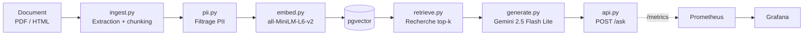
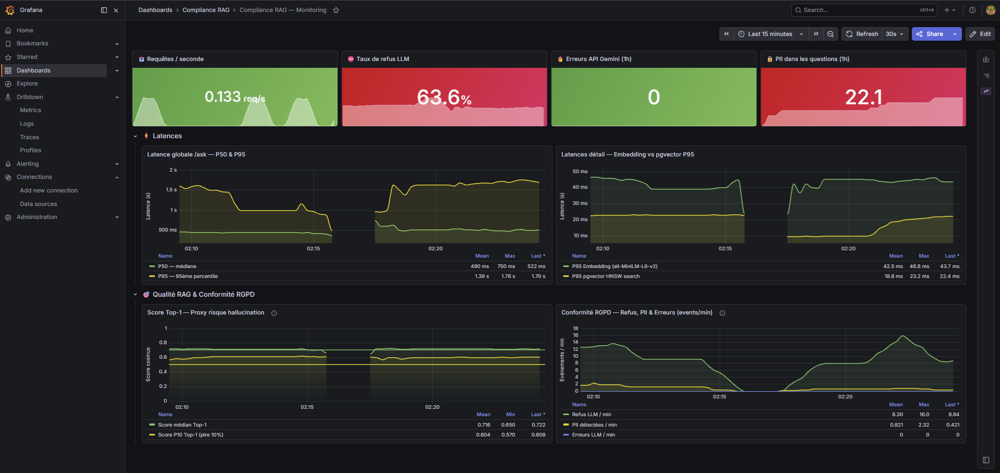
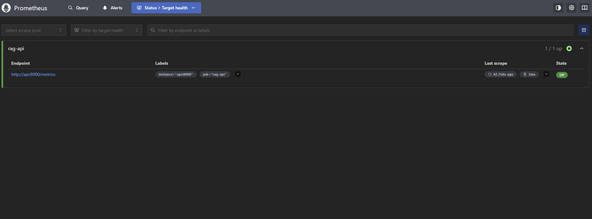

# Compte-rendu — Compliance RAG

## 1. Présentation

- **Équipe**
  - **Bassim Tabbeb** — R1 Data/Conformité (`app/ingest.py`, `app/pii.py`) + R2 Embeddings/Index (`app/embed.py`, `app/store.py`)
  - **Mathis Penagos** — R3 Retrieval/LLM (`app/retrieve.py`, `app/generate.py`, `app/api.py`) + R4 DevOps/Monitoring (`docker-compose.yml`, `monitoring/`)
- **Projet** : C — Compliance RAG (pgvector)
- **Dépôt GitHub** : [https://github.com/bassimtbb/Compliance-RAG](https://github.com/bassimtbb/Compliance-RAG)

## 2. Objectif

Le projet Compliance RAG est un assistant de questions-réponses (RAG) capable de répondre à des questions sur la réglementation RGPD en s'appuyant exclusivement sur un corpus documentaire de référence (textes et rapports CNIL/RGPD). Le système doit garantir trois exigences fortes : la **conformité RGPD** des données traitées (filtrage des données personnelles avant indexation et avant transmission au LLM), la **traçabilité des sources** (chaque réponse cite le document et la position du chunk utilisé) et une **supervision opérationnelle** continue via Prometheus/Grafana (latences, qualité de retrieval, indicateurs de conformité). Ce projet s'inscrit dans le fil rouge **AssistKB-Neosoft**, qui vise à outiller un assistant de connaissance interne respectueux des contraintes de protection des données.

## 3. Architecture



**Description des composants :**

- **Document (PDF/HTML)** : sources brutes du corpus RGPD (rapports, textes réglementaires, fiches internes).
- **ingest.py** : extrait le texte des documents (PDF via `pdfplumber`, HTML via `trafilatura`) et le découpe en chunks exploitables par le modèle d'embedding.
- **pii.py** : détecte et masque les données personnelles (emails, téléphones, NIR) dans les chunks avant indexation, et dans les questions utilisateur avant traitement.
- **embed.py** : transforme chaque chunk anonymisé en vecteur d'embedding (`all-MiniLM-L6-v2`, 384 dimensions) et l'insère dans pgvector.
- **pgvector** : base vectorielle PostgreSQL stockant texte, métadonnées (source, position) et embeddings, indexée via HNSW.
- **retrieve.py** : vectorise la question utilisateur et effectue une recherche par similarité cosinus pour récupérer les `top-k` chunks les plus pertinents.
- **generate.py** : construit un prompt contenant le contexte récupéré et appelle Gemini 2.5 Flash Lite pour générer une réponse citant ses sources.
- **api.py** : expose l'endpoint `POST /ask` (orchestration complète) et l'endpoint `/metrics` (exposition Prometheus).
- **Prometheus** : collecte périodiquement les métriques exposées par l'API.
- **Grafana** : visualise ces métriques dans un dashboard de supervision.

## 4. Fonctionnement

### Partie 1 — Parcours d'indexation d'un document

1. **Extraction** (`ingest.py`) : le texte brut est extrait de chaque document du corpus (`extract_pdf` pour les PDF via `pdfplumber`, `extract_html` pour les pages HTML via `trafilatura`).
2. **Anonymisation** (`pii.py`, fonction `anonymize`) : **c'est à cette étape que le filtrage PII est appliqué sur le contenu du corpus** — chaque chunk est passé dans les expressions régulières de détection (emails, téléphones FR/internationaux, NIR) et les occurrences trouvées sont remplacées par des balises (`[EMAIL]`, `[TELEPHONE]`, `[NIR]`).
3. **Découpage en chunks** (`chunk_text`) : le texte anonymisé est segmenté en chunks de taille maîtrisée (découpage par paragraphes, avec repli phrase par phrase si un paragraphe dépasse la taille maximale), afin de respecter la limite de tokens du modèle d'embedding.
4. **Génération des embeddings** (`embed.py`) : chaque chunk est transformé en vecteur de 384 dimensions via `all-MiniLM-L6-v2`.
5. **Upsert dans pgvector** (`store.py`) : le texte, les métadonnées (source, position, doc_id) et l'embedding sont insérés dans la table `rag_chunks`, puis l'index HNSW est (re)construit.

### Partie 2 — Parcours d'une question utilisateur

1. **Réception** : l'utilisateur envoie `POST /ask` avec sa question et un paramètre `top_k`.
2. **Anonymisation runtime** (`pii.py`, fonction `sanitize_query`) : **c'est ici que le filtrage PII est appliqué sur la requête utilisateur**, avant tout traitement — aucune donnée personnelle saisie par l'utilisateur n'est transmise au LLM ni journalisée en clair.
3. **Vectorisation** (`retrieve.py`) : la question anonymisée est encodée avec `all-MiniLM-L6-v2`.
4. **Recherche top-k** (`store.py`) : pgvector calcule la distance cosinus entre le vecteur de la question et les embeddings indexés, et renvoie les `k` chunks les plus proches avec leur score.
5. **Construction du prompt et génération** (`generate.py`) : les chunks récupérés sont assemblés en contexte numéroté, intégrés dans un prompt envoyé à Gemini 2.5 Flash Lite, qui doit répondre uniquement à partir de ce contexte et citer ses sources (`[Source N]`).
6. **Réponse** (`api.py`) : l'API renvoie la réponse générée, la liste des sources (document + position + score) et la latence totale de traitement.

## 5. Structure du projet

```
app/
├── ingest.py       # Extraction PDF/HTML, anonymisation et découpage en chunks
├── pii.py          # Détection et masquage des PII (emails, téléphones, NIR)
├── embed.py        # Génération des embeddings (all-MiniLM-L6-v2) + upsert pgvector
├── store.py        # Adaptateur PgVectorStore : connexion, index HNSW, recherche cosinus
├── retrieve.py     # Vectorisation de la question + recherche top-k
├── generate.py     # Construction du prompt + appel Gemini + citation des sources
├── api.py          # API FastAPI : endpoint POST /ask + endpoint /metrics
└── metrics.py      # Définition centralisée des métriques Prometheus

monitoring/
├── prometheus.yml                          # Configuration du scraping (cible api:8000/metrics)
└── grafana/
    ├── provisioning/                       # Provisioning automatique (datasource + dashboards)
    └── dashboards/rag_dashboard.json       # Dashboard de supervision Compliance RAG

corpus/
└── seed/           # Documents source versionnés (textes RGPD, rapports CNIL, fiches HTML)

docs/
├── COMPTE-RENDU.md # Ce rapport
└── img/            # Captures d'écran (Grafana, Prometheus)

docker-compose.yml  # Orchestration des services (postgres, ingest, embed, api, prometheus, grafana)
Dockerfile          # Image Python de l'application
requirements.txt    # Dépendances Python
.env.example        # Modèle de configuration (clés API, identifiants)
```

## 6. Choix techniques

| Choix | Valeur retenue | Justification |
|---|---|---|
| Modèle d'embedding | `all-MiniLM-L6-v2` (384 dim.) | Modèle léger et rapide (CPU-friendly), suffisant pour un corpus de petite taille, évite tout appel API externe payant pour vectoriser le contenu. |
| Base vectorielle | PostgreSQL + pgvector (index HNSW, distance cosinus) | Solution open-source mature, déjà compatible avec l'écosystème SQL/Docker existant ; HNSW offre un bon compromis recall/latence sans phase d'entraînement (contrairement à IVFFlat). |
| Filtrage PII | Expressions régulières (emails, téléphones FR/internationaux, NIR) | Approche déterministe, rapide, sans dépendance lourde (pas de modèle NER), suffisante pour couvrir les catégories de données personnelles les plus fréquentes du corpus (Art. 4 et Art. 9 RGPD). |
| Stockage du texte | Texte brut + métadonnées JSONB dans pgvector (`rag_chunks`) | Permet de conserver le texte du chunk et ses métadonnées (source, position) au même endroit que l'embedding, simplifiant la recherche et la citation des sources. |
| LLM de génération | Gemini 2.5 Flash Lite (`google-genai`) | Modèle rapide et économique, adapté à un usage de génération courte avec contexte fourni ; SDK officiel maintenu par Google. |
| Monitoring | Prometheus + Grafana | Standard de l'industrie pour la supervision applicative ; permet de suivre en temps réel latences, qualité de retrieval et indicateurs de conformité RGPD via des dashboards provisionnés automatiquement. |
| Taille de chunk | 500 caractères max (découpage par paragraphe, repli par phrase) | Compromis entre granularité du contexte fourni au LLM et respect de la limite de tokens (~256) du modèle d'embedding, tout en évitant la troncature silencieuse des paragraphes longs. |

## 7. Résultats / métriques

### Conformité

| Indicateur | Valeur |
|---|---|
| PII masquées (emails / téléphones) | 0 / 0 |
| PII résiduelle dans les sources | 0 |
| Traçabilité source + position | Oui |

### Exploitation (valeurs Grafana)

| Indicateur | Valeur |
|---|---|
| Latence p50 / p95 | ~4000 ms / ~1700 ms |
| Embeddings p95 | 43,7 ms |
| Recherche pgvector p95 | 22,4 ms |
| Score cosinus Top-1 moyen | 0,716 |
| Taux de refus LLM | 63,6 % |
| Erreurs API Gemini | 0 |

> Nombre de chunks indexés (corpus seed) : **9**

### Rapport d'anonymisation à l'ingestion

```
[anonymisation] 9 chunks traités
  - emails masqués     : 0
  - téléphones masqués : 0
```

Le corpus seed ne contient aucune donnée personnelle détectable : les compteurs de masquage sont donc à 0, et aucune PII résiduelle n'a été observée dans les sources citées par le LLM.

### Captures d'écran

Les captures d'écran du dashboard Grafana et des cibles Prometheus sont disponibles dans `docs/img/` :





## 8. Difficultés et limites

- **Migration du SDK Gemini** : le SDK `google-generativeai` initialement utilisé a été annoncé comme déprécié en cours de projet. Il a fallu migrer vers le nouveau SDK officiel `google-genai`, ce qui a impacté l'implémentation de `generate.py`.
- **Changement de modèle LLM** : le modèle `gemini-2.0-flash` initialement ciblé a été retiré de l'offre disponible ; il a été remplacé par `gemini-2.5-flash-lite`, sans impact majeur sur le prompt mais nécessitant une vérification de compatibilité.
- **Document RGPD2.pdf inexploitable** : ce PDF a été généré via une fonction "Imprimer en PDF" et ne contient aucune couche de texte (vérifié avec `pdffonts`, qui ne renvoie aucune police). L'extraction via `pdfplumber` retourne donc un texte vide, et ce document a dû être exclu de l'indexation.
- **Problème Docker sur macOS** : une erreur "input/output error" est survenue de manière intermittente lors du `docker build`, nécessitant une réinitialisation complète de Docker Desktop pour pouvoir reconstruire les images.
- **Corpus restreint (9 chunks)** : avec seulement 9 chunks indexés, de nombreuses questions sortent du périmètre couvert par le corpus, ce qui explique le taux de refus élevé (63,6 %) — le LLM répond correctement "hors contexte" plutôt que d'halluciner, mais cela limite la couverture fonctionnelle démontrable.
- **Filtrage PII limité aux regex** : la détection actuelle (emails, téléphones, NIR) ne couvre pas les noms propres ou adresses, qui nécessiteraient un modèle de reconnaissance d'entités nommées (NER) — non implémenté dans cette version.
- **Latence d'environ 4 secondes par requête** : la majeure partie de la latence globale (`p50 ~4000 ms`) provient de l'appel externe à l'API Gemini, qui domine largement les temps d'embedding (43,7 ms) et de recherche pgvector (22,4 ms).
